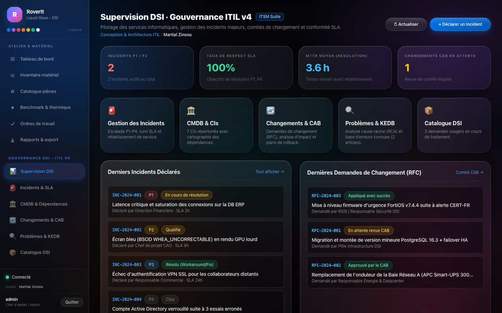
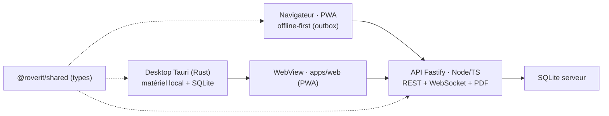
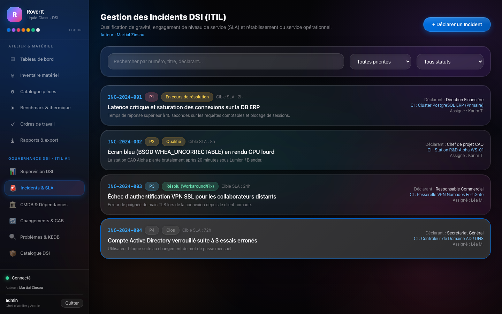
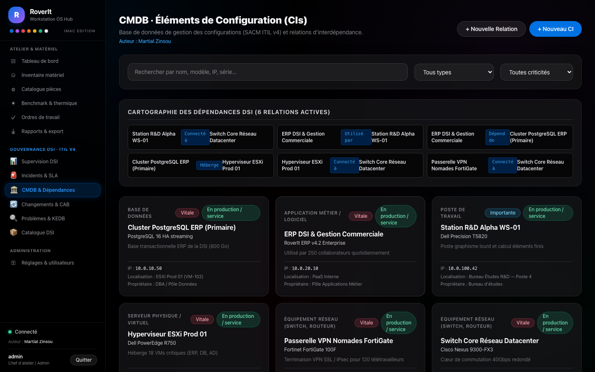
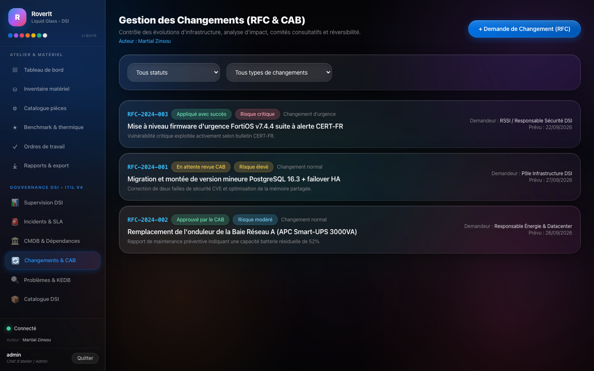
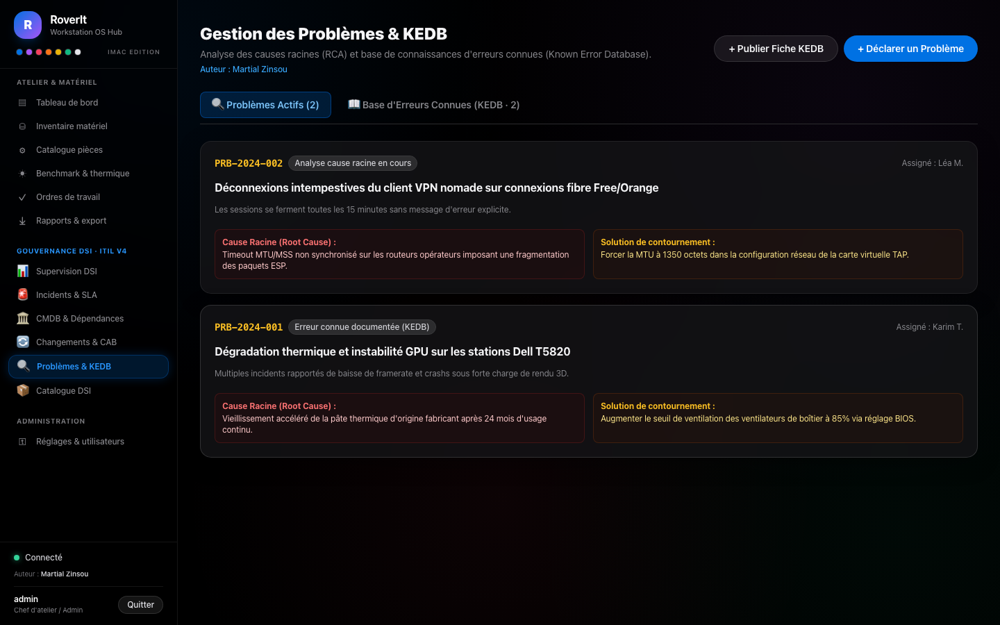
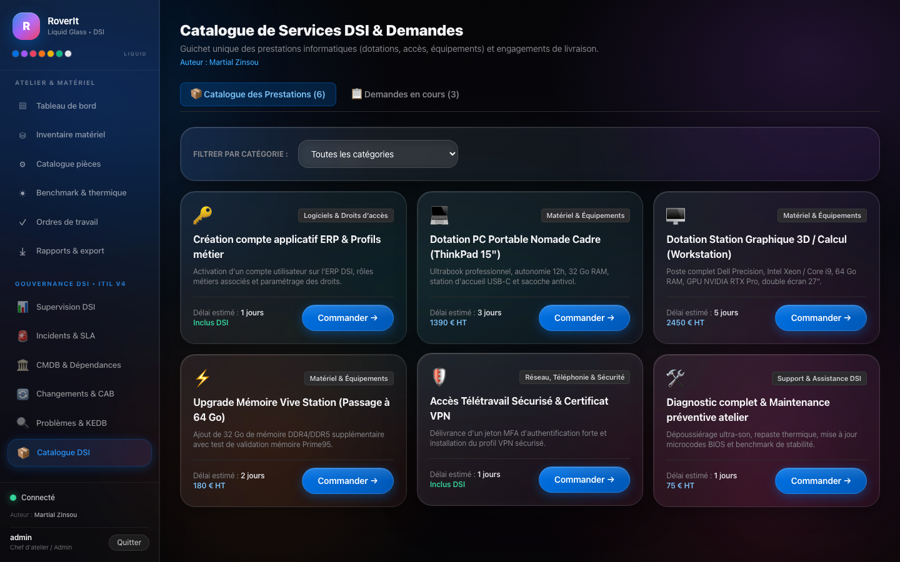

# RoverIt — Workstation OS Hub

> **Auteur du projet : Martial Zinsou**

Application hybride de **gestion technique de matériel, reconditionnement de stations de travail et gouvernance de DSI** (nom de code : **Workstation OS Hub · DSI ITIL v4**). Intègre nativement la gestion d'atelier (diagnostic, benchmark thermique, ordres de travail, catalogue de pièces, rapports PDF) et la suite complète de gouvernance DSI ITIL (Gestion des Incidents P1..P4 & SLA, CMDB & Cartographie de dépendances, Gestion des Changements & CAB, Problèmes & KEDB, Catalogue de services informatiques).




## Vue d'ensemble



## Documentation

| Document | Contenu |
| --- | --- |
| [Wiki Officiel du Projet](docs/wiki/Home.md) | Base de connaissances complète en 7 chapitres (Architecture, Atelier, Benchmark, ITIL, Offline, Sécurité, Déploiement). |
| [Gouvernance DSI & ITIL v4](docs/itil-dsi.md) | Pratiques ITIL v4 (Incidents, CMDB/CIs, Changements/CAB, Problèmes/KEDB, Services). |
| [Cahier des spécifications (SFD)](docs/sfd.md) | Exigences fonctionnelles & techniques complètes. |
| [Architecture & diagrammes UML](docs/architecture.md) | Composants, déploiement, séquences, états, cas d'utilisation (Mermaid). |
| [Modèle de données](docs/data-model.md) | Schéma entité-association, tables, statuts, modèle hors-ligne et CMDB. |
| [Référence API](docs/api.md) | Routes REST + événements WebSocket (Atelier & DSI ITIL). |
| [Guide d'utilisation illustré](docs/usage-guide.md) | Parcours pas à pas avec captures d'écran (`docs/screenshots/`). |

## Architecture

| Layer | Technologie |
| --- | --- |
| Desktop Framework | **Tauri 2 (Rust + HTML/CSS/JS)** |
| Frontend / UI | **React + TypeScript + TailwindCSS** (PWA, partagé desktop/web) |
| Backend / API | **Node.js / TypeScript (Fastify)** — REST + WebSocket |
| Base de données | **SQLite** (local desktop & serveur) — schéma compatible **PostgreSQL** |
| Authentification | **JWT + RBAC** (rôles : Technicien, Chef d'atelier/Admin, Consultant/Client) |

## Structure du dépôt

```
RoverIt/
├── apps/
│   ├── web/           # UI React (dashboard PWA, utilisée par desktop & web)
│   ├── desktop/       # Application desktop Tauri (Rust : profiling, stress test, SQLite local)
│   └── server/        # API Fastify (REST + WebSocket, PDF, synchronisation)
├── packages/
│   └── shared/        # Types métier partagés (Machine, WorkOrder, BenchmarkRun, …)
 └── docs/
     ├── sfd.md              # Cahier de spécifications
     ├── itil-dsi.md         # Gouvernance DSI ITIL v4
     ├── wiki/               # Wiki officiel (7 chapitres + schémas UML)
     └── screenshots/        # 16 captures thème Apple iMac
 ```

## Modules fonctionnels

1. **Gestion des équipements & composants** — inventaire, fiche CI, détection matérielle, catalogue de pièces, alertes de compatibilité.
2. **Supervision & benchmarking** — monitoring thermique/énergétique temps réel, séquenceur de stress test, score de stabilité thermique.
3. **Workflow de reconditionnement & OT** — statuts de cycle de vie, checklists d'intervention, historique de traçabilité.
4. **Reporting & exportation** — fiches techniques PDF, tableau de bord & KPIs.
5. **Gouvernance DSI ITIL v4** — incidents SLA, CMDB, changements CAB, problèmes KEDB, catalogue de services.

### Galerie de captures (thème Apple iMac)

| # | Vue | Capture |
|---|-----|---------|
| 01 | Connexion |  |
| 02 | Tableau de bord Atelier |  |
| 03 | Inventaire matériel |  |
| 11 | Supervision DSI |  |
| 12 | Incidents & SLA |  |
| 13 | CMDB & dépendances |  |
| 14 | Changements & CAB |  |
| 15 | Problèmes & KEDB |  |
| 16 | Catalogue DSI |  |

## Démarrage rapide

### Prérequis
- Node.js ≥ 20
- Rust toolchain (pour le desktop) : https://rustup.rs

### Installation
```bash
npm install
```

### Serveur API + Dashboard web (développement)
```bash
npm run dev:server   # API sur http://localhost:3001
npm run dev:web      # Dashboard sur http://localhost:5173
```

### Application desktop (Tauri)
```bash
npm run dev:desktop
```

### Build de production
```bash
npm run build
npm run build -w @roverit/desktop   # binaire desktop installable
```

### Tests & types
```bash
npm run typecheck
npm test
```

## Accès démo (seedé au démarrage)
| Rôle | Identifiant | Mot de passe |
| --- | --- | --- |
| Admin | `admin` | `admin` |
| Technicien | `tech` | `tech` |
| Consultant | `client` | `client` |

## Sécurité
- Communications TLS 1.3 (reverse proxy de production recommandé : Caddy/Nginx)
- JWT signé (HS256) avec expiration + RBAC (Technicien / Admin / Consultant)
- Mode hors-ligne : SQLite locale sur le desktop + file de synchronisation (outbox) côté web, réplication automatique au retour réseau.

## Auteur & Conception
- **Auteur : Martial Zinsou**
- Projet : RoverIt — Workstation OS Hub & Gestion de DSI (ITIL v4)
