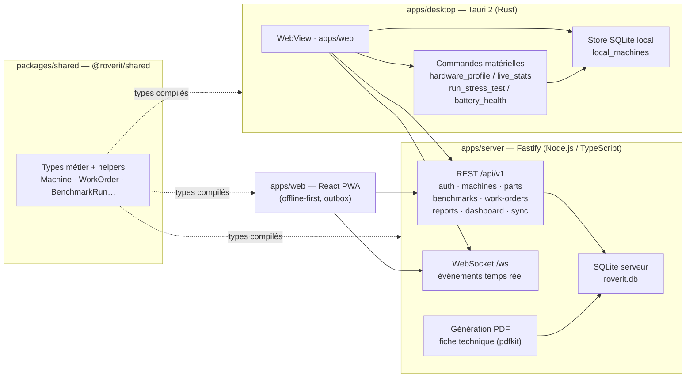
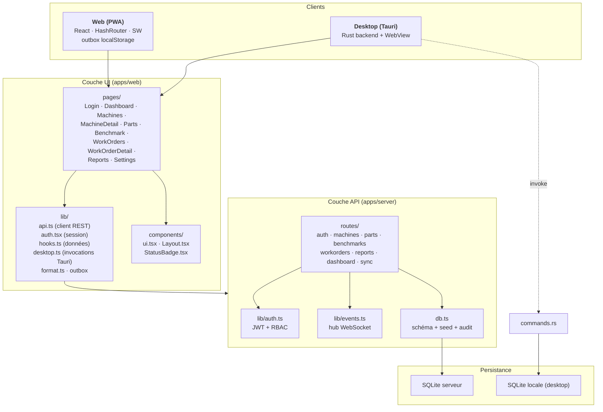
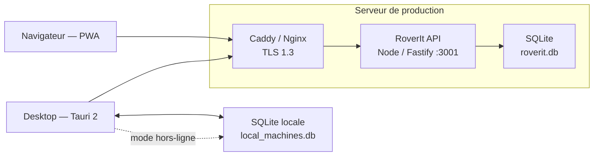
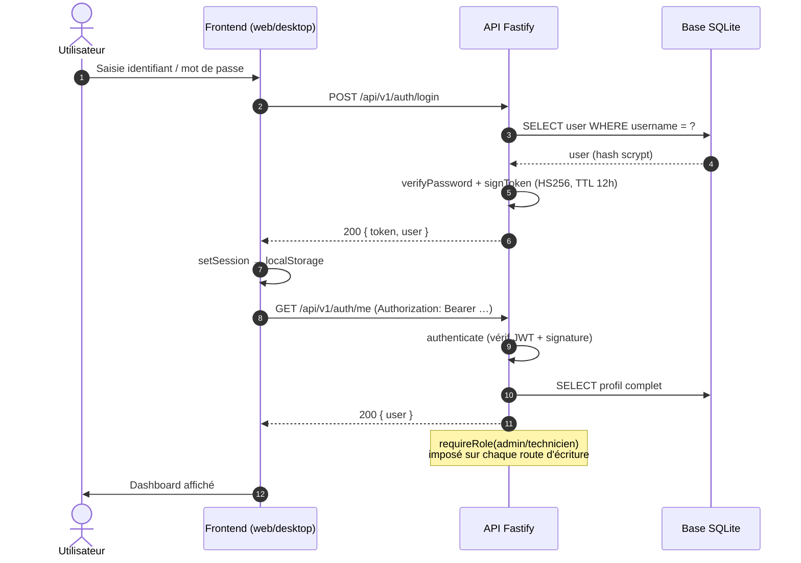
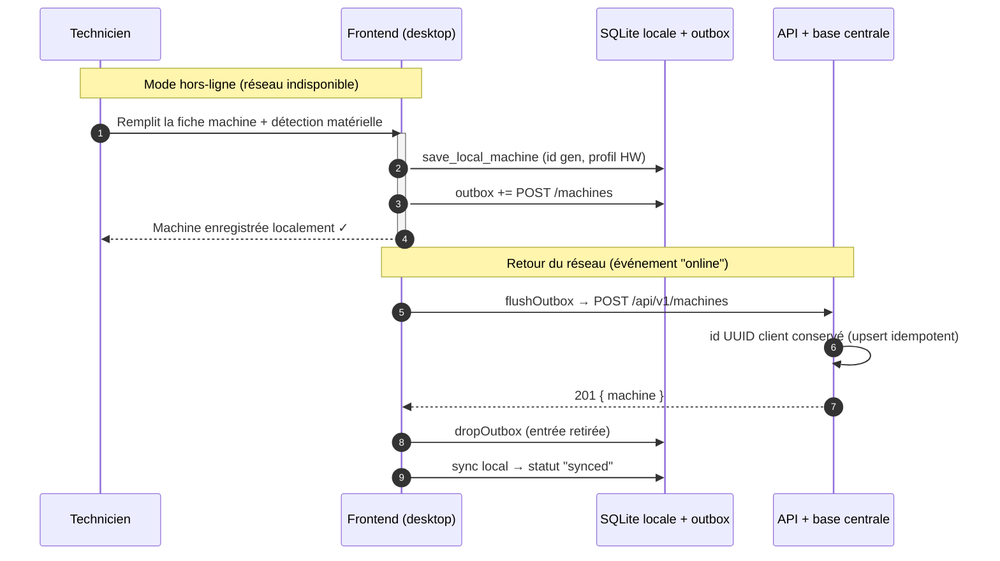
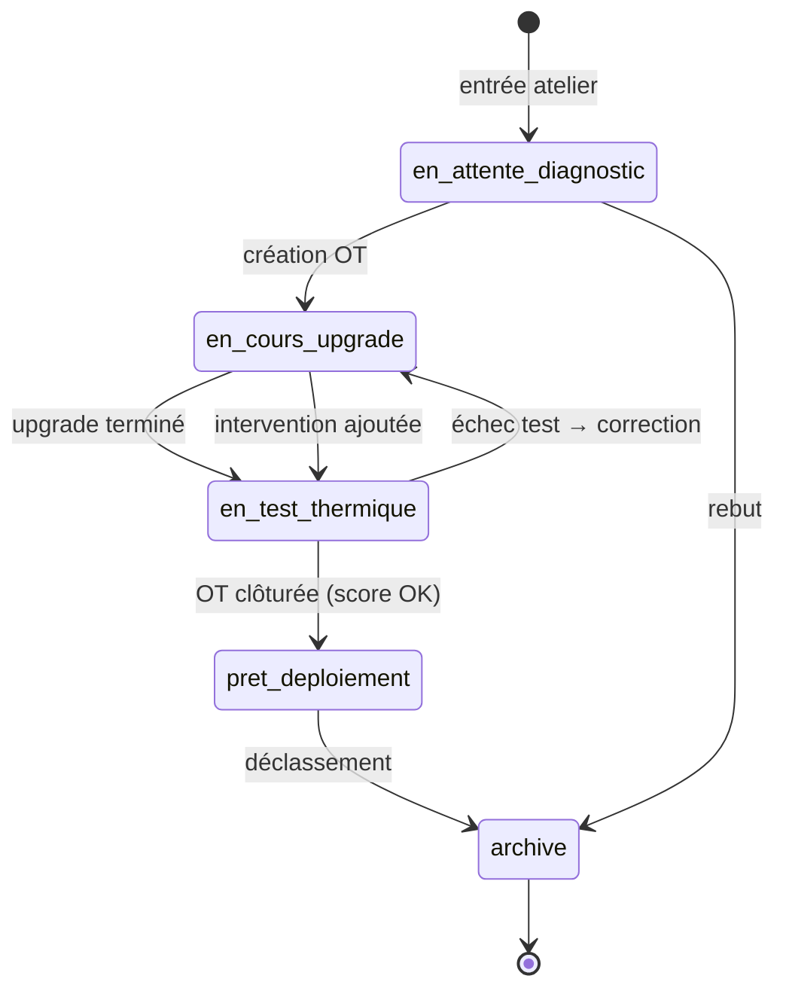
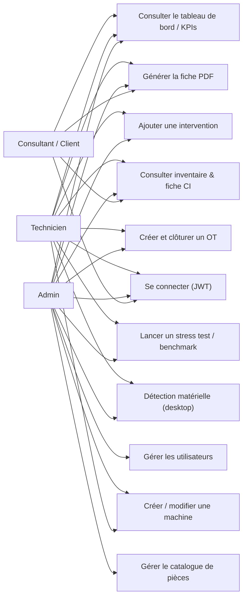

# RoverIt — Architecture technique & diagrammes UML

Ce document décrit l'architecture de l'application **RoverIt (Workstation OS Hub)** et ses principaux flux, illustrés par des **diagrammes UML (Mermaid)** rendus directement sur GitHub.

## 1. Vue d'ensemble des briques

## 2. Diagramme de composants (UML Component)

## 3. Diagramme de déploiement (UML Deployment)

## 4. Flux d'authentification (diagramme de séquence)

## 5. Création de machine — mode hors-ligne (outbox)

## 6. Cycle de vie machine & OT (diagramme d'états)

## 7. Diagramme de cas d'utilisation

## 8. Technologies

| Composant | Technologie | Rôle |
| --- | --- | --- |
| Desktop | Tauri 2, Rust, sysinfo, rusqlite | Réflexion sur les coûts de développement en environnement natif. |
| Frontend | React 18, TypeScript, Tailwind, Recharts, Vite | Interface unique desktop + web. |
| API | Fastify 4, @fastify/cors, @fastify/static, @fastify/websocket | REST + WS + statique. |
| Stockage | better-sqlite3 (serveur), rusqlite (desktop) | Persistance locale/centrale. |
| Auth | jsonwebtoken (HS256), scrypt | Sessions JWT + hachage. |
| Reporting | pdfkit | Fiches techniques PDF. |

## 9. Liens

- [Cahier des charges (SFD)](./sfd.md)
- [Modèle de données](./data-model.md)
- [Référence API](./api.md)
- [Guide d'utilisation illustré](./usage-guide.md)