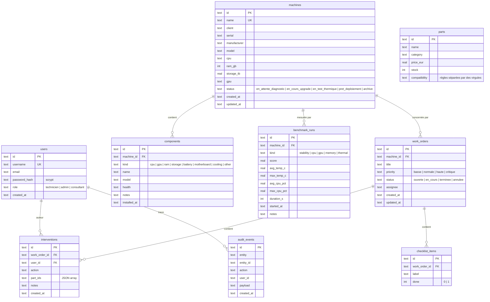
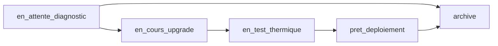
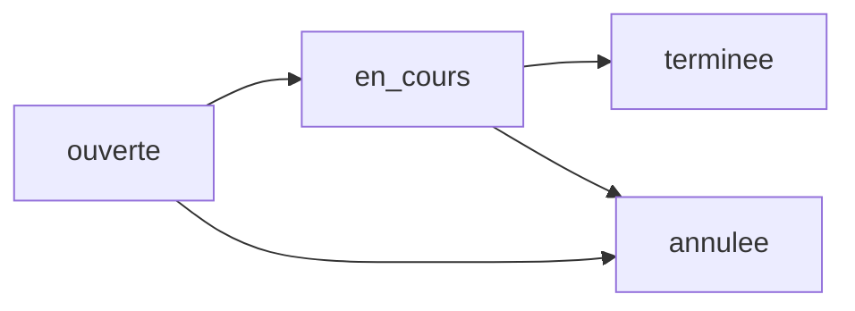
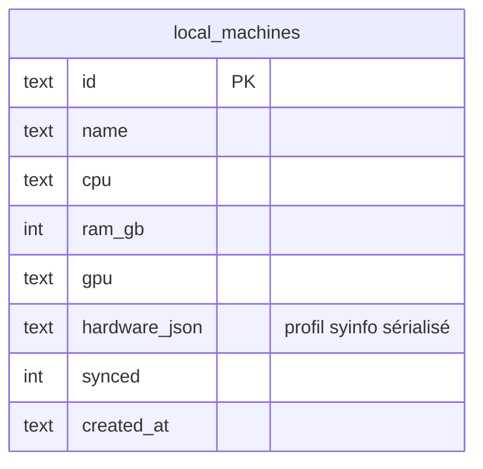

# RoverIt — Modèle de données

Schéma de la base **SQLite** du serveur (identique dans son esprit à la base locale desktop pour les machines hors-ligne). Conçu pour rester migrable vers **PostgreSQL**.

## 1. Diagramme entité-association (UML ER)

## 2. Définition des tables

| Table | Description |
| --- | --- |
| `users` | Utilisateurs (RBAC `role`), mot de passe haché en scrypt. |
| `machines` | Fiche CI : équipement + `status` de cycle de vie. |
| `components` | Composants installés sur une machine (avec état de santé). |
| `parts` | Catalogue de pièces (prix, stock, règles de compatibilité). |
| `benchmark_runs` | Runs de stress/stabilité par machine (`score` 0-100). |
| `work_orders` | Ordres de travail liés à une machine. |
| `interventions` | Actions tracées sur un OT (auteur = `user_id`). |
| `checklist_items` | Éléments de checklist générés à la création d'un OT. |
| `audit_events` | Journal de traçabilité (who / what / when). |

## 3. Statuts possibles

### Cycle de vie machine (`machines.status`)

### Statuts d'OT (`work_orders.status`)

## 4. Index & contraintes

- `PRAGMA foreign_keys = ON` (cascade de suppression sur machines/work_orders).
- `PRAGMA journal_mode = WAL` (lectures/écritures concurrentes Fluides).
- Identifiants : `TEXT` UUID (`newId()` = `crypto.randomUUID()`) pour faciliter les **upserts idempotents** hors-ligne/online.
- Compatibilité le jour où l'on migre vers PostgreSQL : les colonnes `TEXT` pour toutes les clés et horodatages ISO 8601 simplifient la conversion.

## 5. Modèle local desktop (hors-ligne)

- Écrit par `commands.rs::save_local_machine` au moment de la création hors-ligne.
- Synchronisé vers le serveur via `POST /api/v1/sync` (upsert) au retour du réseau.
- Le champ `hardware_json` conserve le profil matériel complet détecté.