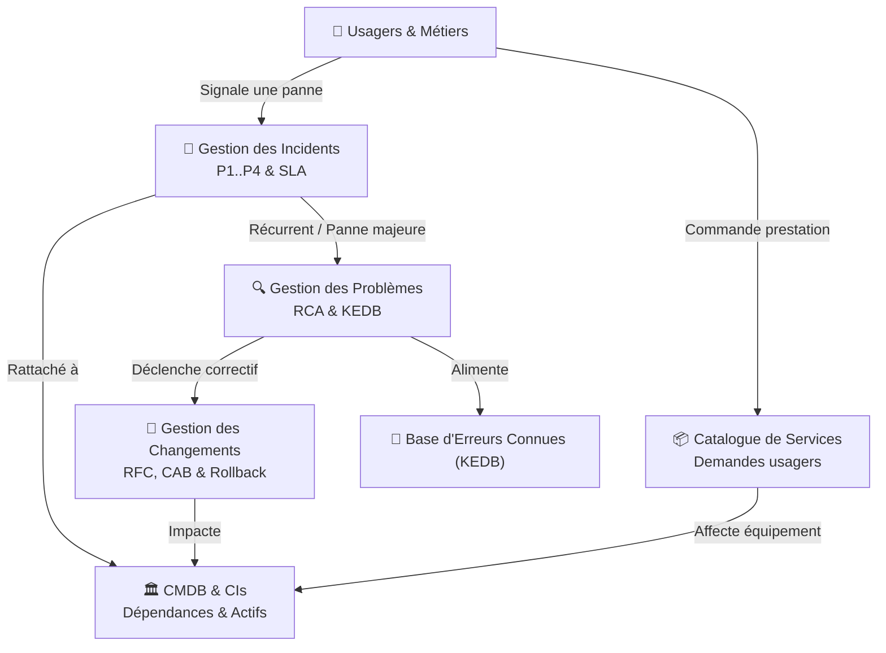
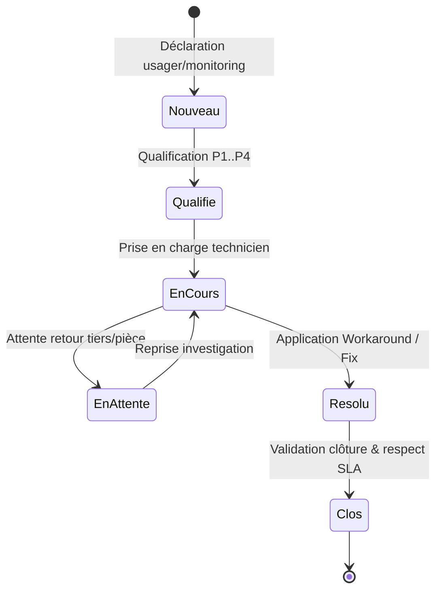
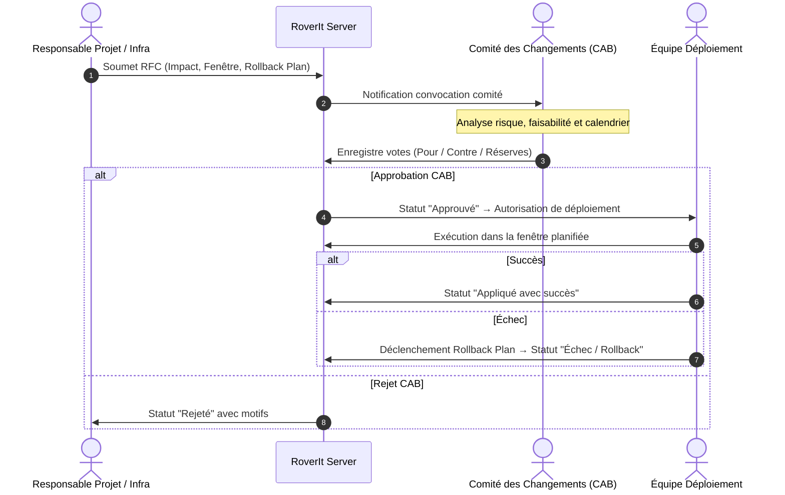

# RoverIt — Gouvernance DSI & Pratiques ITIL v4

> **Auteur du document & Architecture : Martial Zinsou**  
> **Application : RoverIt (Workstation OS Hub & DSI Management)**  
> **Référentiel : ITIL v4 (Information Technology Infrastructure Library)**  
> **Version : 0.1.0**

---

## 1. Contexte et Vision DSI

Dans le cadre de la gestion technique d'un parc informatique et du pilotage d'une **Direction des Systèmes d'Information (DSI)**, **RoverIt** intègre nativement les pratiques fondamentales du référentiel **ITIL v4**.

Cette suite permet à la DSI d'assurer :
- La **continuité de service** et le respect des engagements contractuels (**SLA**).
- La maîtrise des risques lors des interventions et évolutions d'infrastructure (**CAB & Rollback**).
- La visibilité exhaustive sur les actifs matériels, réseaux et applicatifs (**CMDB**).
- La capitalisation des savoirs et la réduction du temps moyen de rétablissement (**MTTR** via la **KEDB**).
- La fluidité des échanges avec les utilisateurs grâce au **Catalogue de Services DSI**.

---

## 2. Les 5 Pratiques ITIL Implémentées

---

## 3. Pratique 1 : Gestion des Incidents & SLA (Incident Management)

L'objectif est de restaurer le fonctionnement normal des services informatiques le plus rapidement possible avec un impact minimal sur l'activité métier.

### 3.1. Matrice ITIL de Calcul de Priorité

La priorité est calculée automatiquement par croisement de l'**Impact métier** et de l'**Urgence opérationnelle** :

| Impact \ Urgence | Critique | Haute | Moyenne | Faible |
| :--- | :---: | :---: | :---: | :---: |
| **Critique (Bloque l'entreprise)** | **P1** | **P1** | **P2** | **P2** |
| **Élevé (Service dégradé)** | **P1** | **P2** | **P2** | **P3** |
| **Moyen (Gêne utilisateur)** | **P2** | **P2** | **P3** | **P4** |
| **Faible (Marginal)** | **P2** | **P3** | **P4** | **P4** |

### 3.2. Cibles d'Engagement de Service (SLA de Résolution)

- **P1 — Critique (Urgence vitale)** : Rétablissement sous **2 heures** maximum.
- **P2 — Majeur (Dégradation forte)** : Rétablissement sous **8 heures**.
- **P3 — Moyen (Gêne opérationnelle)** : Rétablissement sous **24 heures** (1 jour ouvré).
- **P4 — Mineur (Impact marginal)** : Traitement sous **72 heures** (3 jours ouvrés).

### 3.3. Cycle de Vie d'un Incident

---

## 4. Pratique 2 : Gestion des Éléments de Configuration (CMDB / SACM)

La **Configuration Management Database (CMDB)** centralise les Éléments de Configuration (CIs) et leurs interdépendances critiques.

### 4.1. Catégories de CIs DSI
- **Serveurs physiques et virtuels** (Hyperviseurs ESXi, serveurs bare-metal).
- **Réseau & Sécurité** (Switchs de cœur 40G, routeurs, passerelles VPN Fortinet).
- **Bases de Données** (Clusters PostgreSQL, SQL Server).
- **Applications & ERP** (ERP métier, logiciels de conception CAO/3D).
- **Postes de travail & Stations** (Workstations lourdes reconditionnées RoverIt, ordinateurs portables).

### 4.2. Types de Relations
- `depend_de` : Ex. L'application ERP *dépend de* la base de données.
- `heberge` : Ex. L'hyperviseur ESXi *héberge* la machine virtuelle DB.
- `connecte_a` : Ex. La station CAO est *connectée au* switch cœur de réseau.
- `utilise_par` : Ex. Le client lourd ERP est *utilisé par* la station d'ingénierie.
- `redondance_de` : Ex. Le nœud secondaire PostgreSQL assure la *redondance de* l'instance primaire.

---

## 5. Pratique 3 : Gestion des Changements & CAB (Change Enablement)

Toute modification majeure apportée à la production doit être contrôlée pour prévenir les incidents causés par les changements imprévus.

### 5.1. Classification des RFC (Request For Change)
- **Changement Standard** : Procédure pré-autorisée, récurrente et à faible risque (ex: ajout de mémoire vive, renouvellement de certificat standard).
- **Changement Normal** : Nécessite une analyse d'impact complète, un plan de rollback formel et l'approbation du **Change Advisory Board (CAB)**.
- **Changement d'Urgence** : Traité par l'**Emergency CAB (ECAB)** lors d'un incident de sécurité critique (ex: faille Zero-Day, CVE active).

### 5.2. Workflow de Revue CAB

---

## 6. Pratique 4 : Gestion des Problèmes & KEDB (Problem Management)

La gestion des problèmes s'attaque aux causes structurelles sous-jacentes pour prévenir la réapparition des pannes.

### 6.1. Analyse de Cause Racine (RCA)
- Identification du défaut physique (ex: assèchement de pâte thermique sur GPU sous forte charge continue).
- Méthode des **5 Pourquoi** et traçabilité dans la fiche problème.

### 6.2. Base de Connaissances des Erreurs Connues (KEDB)
- Documente pour chaque problème identifié :
  - **Symptômes exacts** constatés par l'usager.
  - **Cause racine** prouvée techniquement.
  - **Solution de contournement (Workaround)** permettant une remise en service immédiate.
  - **Correctif permanent (Permanent Fix)** déployé à terme par changement RFC.
- Moteur de recherche instantané à destination des techniciens de support niveau 1 et 2.

---

## 7. Pratique 5 : Catalogue de Services & Demandes (Service Requests)

Le catalogue formalise les offres standards de la DSI pour les collaborateurs de l'organisation :

- **Dotation Matériel** : Station fixe haute performance 3D, PC portable nomade cadre.
- **Logiciels & Droits** : Création de compte applicatif, accès ERP, licence CAO.
- **Réseau & Mobilité** : Profil VPN nomade avec MFA, clé de sécurité FIDO2.
- **Support & Atelier** : Diagnostic atelier, upgrade mémoire vive RAM, nettoyage et reconditionnement thermique.

Chaque demande intègre :
- Le bénéficiaire et son département.
- L'échéance cible de livraison (SLA de livraison).
- Le circuit de validation managériale et technique.

---

## 8. Indicateurs Clés de Performance DSI (KPIs)

| Indicateur | Définition ITIL | Cible DSI RoverIt |
| :--- | :--- | :---: |
| **SLA Compliance Rate** | % d'incidents résolus avant expiration de la cible SLA | **≥ 95%** |
| **MTTR (Mean Time To Resolve)** | Temps moyen de rétablissement du service opérationnel | **< 4 heures** |
| **Taux de succès des Changements** | % de RFC appliquées sans déclenchement de rollback | **≥ 98%** |
| **Taux de couverture KEDB** | % d'incidents récurrents résolus via un workaround KEDB | **≥ 80%** |
| **Respect SLA Commandes** | % de demandes de services livrées dans les délais affichés | **≥ 90%** |

---

## 9. Conclusion

Grâce à cette implémentation, **RoverIt** transforme l'atelier de reconditionnement en un véritable **Centre de Services et de Supervision DSI**, aligné sur les meilleures pratiques industrielles internationales.

---

> Document conçu, modélisé et documenté par **Martial Zinsou**, Auteur et Architecte de la solution RoverIt.
