# RoverIt — Guide d'utilisation illustré

Guide pas à pas des fonctionnalités de **RoverIt (Workstation OS Hub)**, illustré de captures d'écran de l'interface (comptes démo seedés au démarrage du serveur).

> Accès de démonstration : `admin/admin` (admin) · `tech/tech` (technicien) · `client/client` (consultant).

## Sommaire
1. [Connexion](#1-connexion)
2. [Tableau de bord & KPIs](#2-tableau-de-bord--kpis)
3. [Inventaire & CMDB](#3-inventaire--cmdb)
4. [Fiche machine (détail)](#4-fiche-machine-détail)
5. [Catalogue de pièces](#5-catalogue-de-pièces)
6. [Benchmark & supervision thermique](#6-benchmark--supervision-thermique)
7. [Ordres de travail](#7-ordres-de-travail)
8. [Détail d'un ordre de travail](#8-détail-dun-ordre-de-travail)
9. [Rapports & export PDF](#9-rapports--export-pdf)
10. [Réglages & utilisateurs](#10-réglages--utilisateurs)

---

## 1. Connexion

L'application démarre sur l'écran de connexion. Saisissez l'identifiant et le mot de passe, puis cliquez sur **Se connecter**.

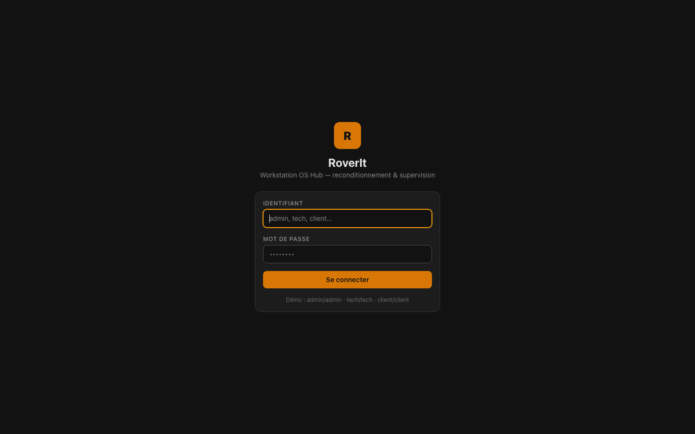

Le jeton **JWT** est conservé dans le navigateur : les requêtes suivantes sont authentifiées automatiquement.

---

## 2. Tableau de bord & KPIs

Après connexion, le **tableau de bord** (Module 4) synthétise l'activité :

- **Machines (CMDB)** et livraisons des 30 derniers jours ;
- **Score de stabilité moyen** (vert si ≥ 85) ;
- **OT ouverts / total** et **interventions des 30 jours** ;
- **Répartition du parc** par cycle de vie (camembert) ;
- **Priorités des OT** (histogramme) ;
- **Dernières machines** et **derniers OT** (accès direct cliquable).

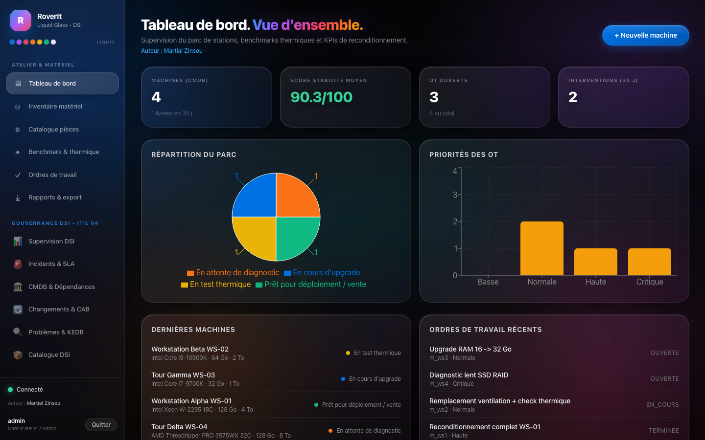

---

## 3. Inventaire & CMDB

La page **Inventaire & CMDB** (Module 1) liste toutes les machines triées par date de mise à jour, avec filtres par statut de cycle de vie.

Le bouton **+ Nouvelle machine** ouvre un formulaire pré-rempli automatiquement par la **détection matérielle** en mode desktop (CPU, RAM, stockage, nom d'hôte).

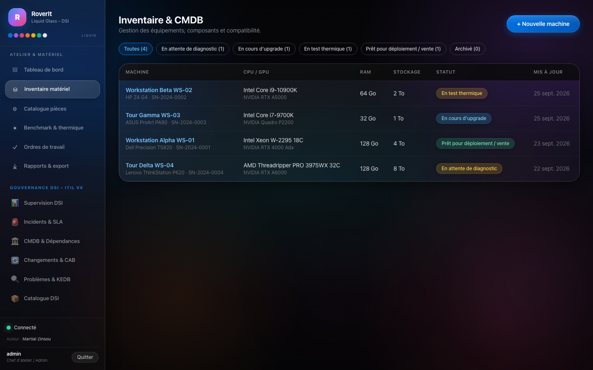

> En mode hors-ligne, la création est mise en **file d'attente (outbox)** puis envoyée automatiquement au retour du réseau.

---

## 4. Fiche machine (détail)

Cliquez sur une machine pour ouvrir sa **fiche CI complète** : renseignements techniques, **composants installés** avec état de santé, **historique des benchmarks** et **ordres de travail** liés.

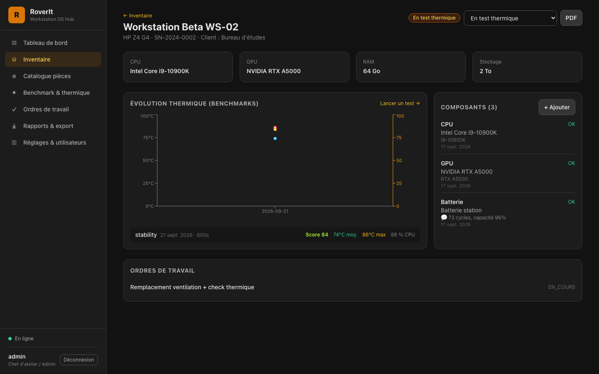

---

## 5. Catalogue de pièces

Le **catalogue de pièces** (Module 1) regroupe les références (RAM, stockage, GPU, refroidissement…), leurs prix, stocks et **règles de compatibilité**. Un contrôle de compatibilité (`/parts/compatibility-check`) signale les mises en garde avant installation sur une machine donnée.

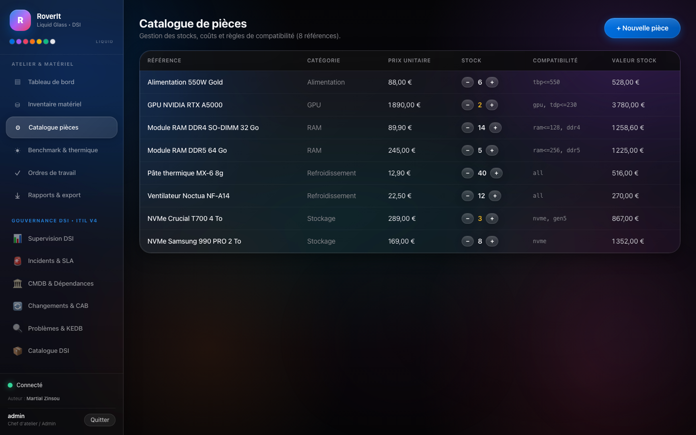

---

## 6. Benchmark & supervision thermique

La page **Benchmark & supervision thermique** (Module 2) :

- **Monitoring temps réel** (mode desktop) : CPU, mémoire, température, fréquence, uptime ;
- **Séquenceur de stress test** : machine, type de test (`stability`, `cpu`, `gpu`, `memory`, `thermal`), durée (10 → 600 s) — charge réelle en desktop, simulée côté serveur ;
- **Historique des runs** : graphique températures/score et détail de chaque run.

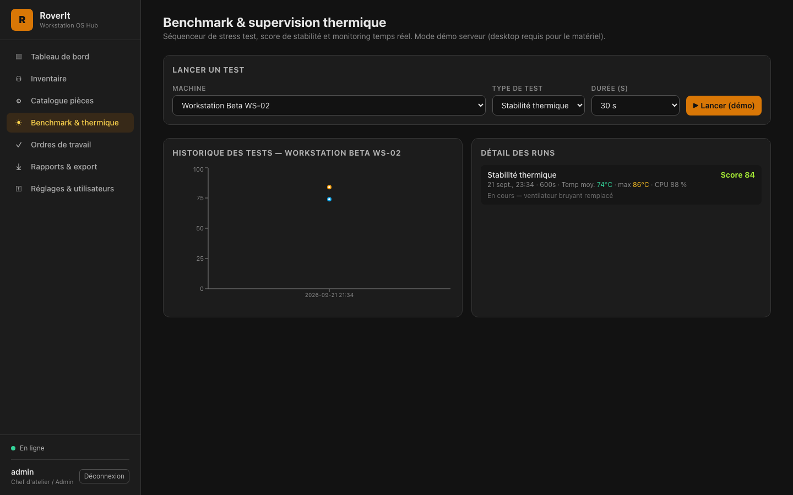

---

## 7. Ordres de travail

La page **Ordres de travail** (Module 3) liste les OT par machine avec priorité et statut. La création d'un OT génère automatiquement la **checklist d'intervention** standard.

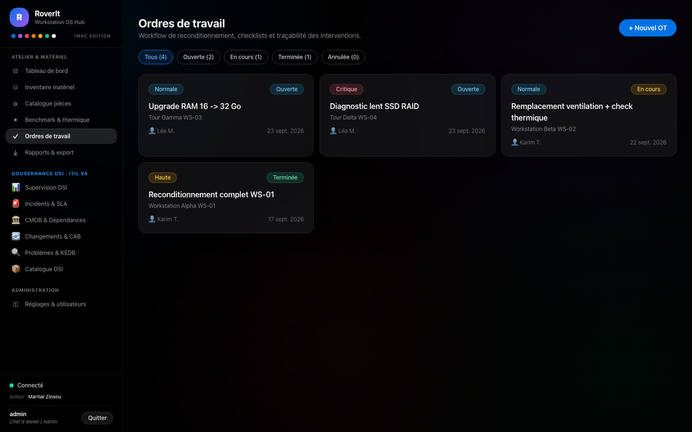

---

## 8. Détail d'un ordre de travail

La fiche OT réunit :

- la **checklist** (éléments cochables par le technicien) ;
- l'**ajout d'interventions** tracées (action, notes, pièces) ;
- l'**historique complet** des interventions avec auteur.

La clôture de l'OT bascule automatiquement la machine en **pret_deploiement**.

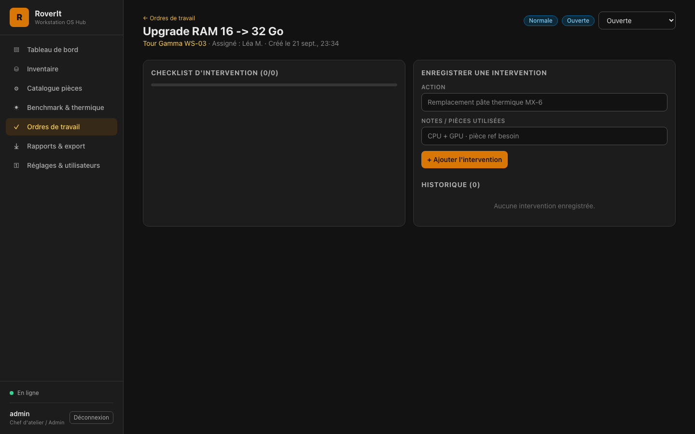

---

## 9. Rapports & export PDF

La page **Rapports & exportation** (Module 4) permet de :

- télécharger la **fiche technique PDF** d'une machine (pdfkit) ;
- consulter la liste des **machines prêtes au déploiement/vendant** ;
- afficher le **bilan GPU upgrade vs performances** (score, livraisons, interventions).

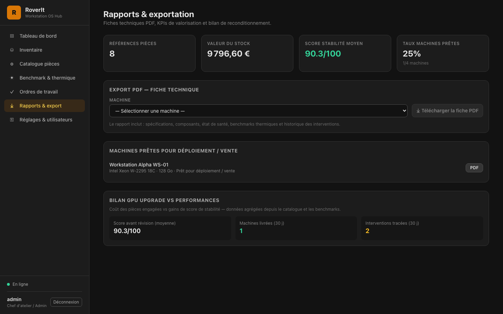

---

## 10. Réglages & utilisateurs

En tant qu'**admin**, la page **Réglages & utilisateurs** donne accès à la gestion des comptes du référentiel.

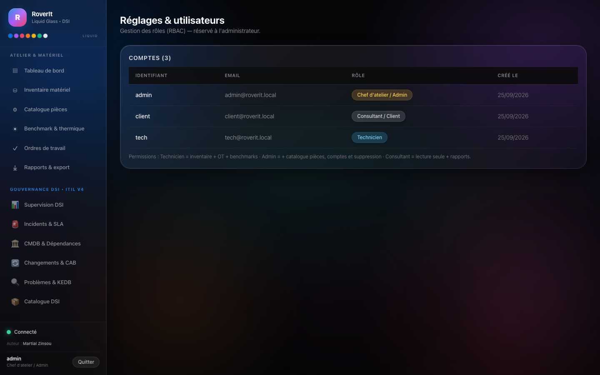

---

## Opérations hors-ligne

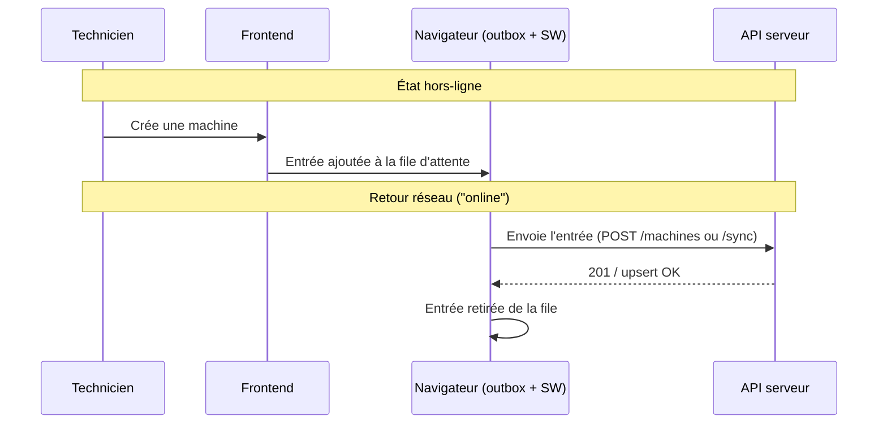

## Limites de l'accès par rôle

| Fonction | Technicien | Admin | Consultant |
| --- | :-: | :-: | :-: |
| Consultation (dashboard, fiches, rapports) | ✅ | ✅ | ✅ |
| Machines / composants (création, édition) | ✅ | ✅ | ❌ |
| OT / interventions / checklist | ✅ | ✅ | ❌ |
| Benchmark (démo ou réel) | ✅ | ✅ | ❌ |
| Catalogue de pièces (écriture) | ❌ | ✅ | ❌ |
| Utilisateurs & réglages | ❌ | ✅ | ❌ |
| Suppression de machine | ❌ | ✅ | ❌ |