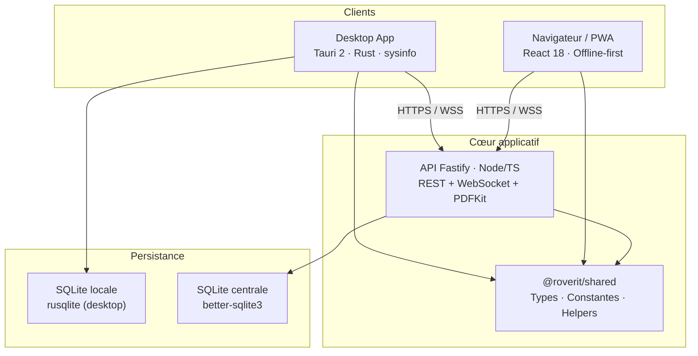
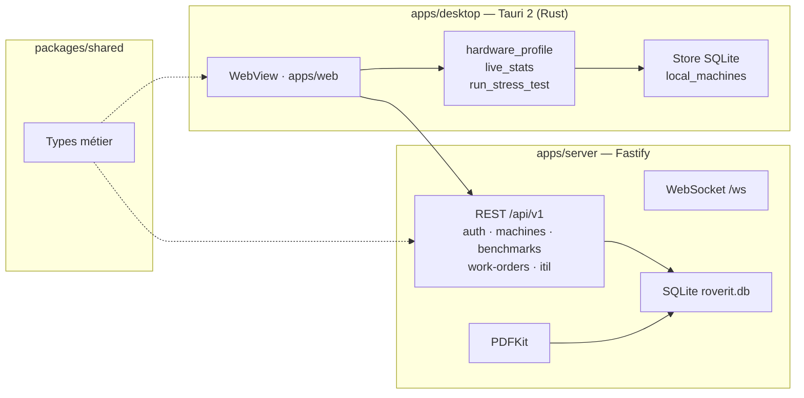
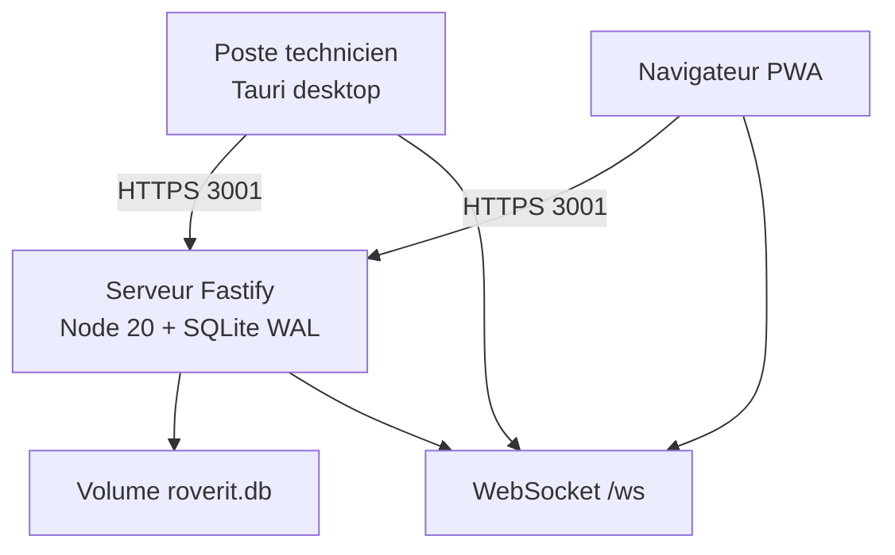
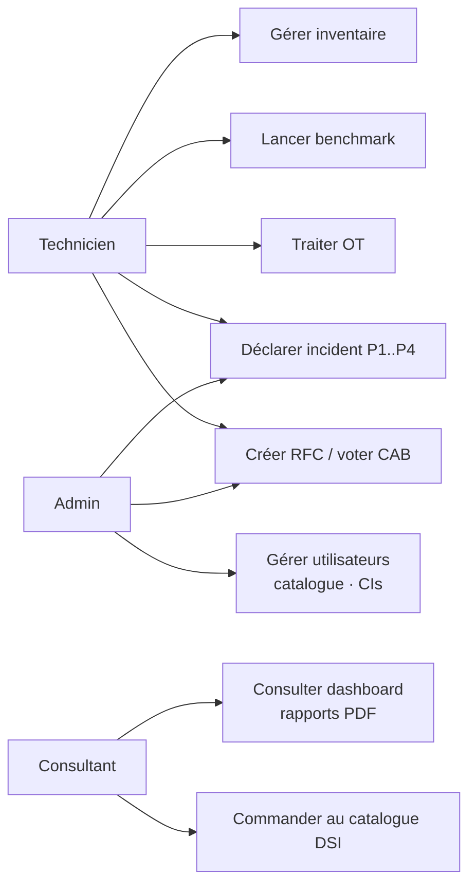
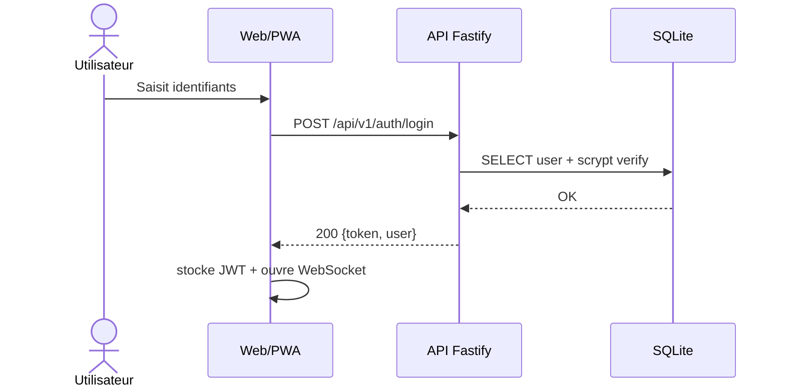

# Wiki · 01. Architecture Globale & Choix Techniques

> **Auteur : Martial Zinsou**  
> **Projet : RoverIt — Workstation OS Hub & DSI ITIL v4**

---

## 1. Vue d'ensemble du système

RoverIt repose sur une architecture monorepo en trois couches avec un package partagé garantissant l'intégrité des contrats de données.

### Capture — Thème Apple iMac

*Page de connexion — verre dépoli et palette des 7 couleurs iMac.*

---

## 2. Découpage du monorepo

| Répertoire | Rôle | Stack |
| :--- | :--- | :--- |
| `packages/shared` | Types, validateurs, helpers | TypeScript 5.5 |
| `apps/server` | REST + WS + PDF + SQLite | Fastify 4, pdfkit, ws |
| `apps/web` | UI unique (PWA & desktop) | React 18, Vite 5, Tailwind 3, Recharts |
| `apps/desktop` | Enveloppe native + télémétrie | Tauri 2, Rust, sysinfo 0.32 |

---

## 3. Diagramme de composants UML

---

## 4. Diagramme de déploiement UML

---

## 5. Diagramme de cas d'utilisation

---

## 6. Séquence — Authentification JWT

---

## 7. Communication temps réel

WebSocket `/ws` diffuse `hello`, `machines`, `work_orders`, `itil_incident_created`, `itil_change_created` à tous les clients connectés.

---

> Rédigé par **Martial Zinsou**.
