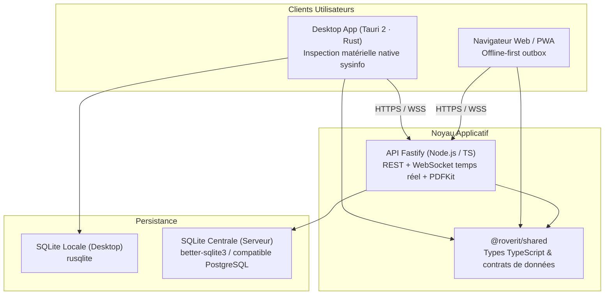

# Wiki · 01. Architecture Globale & Choix Techniques

> **Auteur : Martial Zinsou**  
> **Projet : RoverIt — Workstation OS Hub**

---

## 1. Vue d'ensemble du système

RoverIt repose sur une architecture moderne monorepo découplée en trois couches applicatives principales et un package partagé garantissant l'intégrité des contrats de données.

---

## 2. Découpage du Monorepo

| Répertoire | Rôle | Technologies principales |
| :--- | :--- | :--- |
| `packages/shared` | Types TypeScript stricts, validateurs, helpers temporels et constantes | TypeScript 5.5 |
| `apps/server` | Serveur API REST, passerelle WebSocket, moteur PDF et schéma SQLite | Fastify 4, better-sqlite3, pdfkit, ws |
| `apps/web` | Interface utilisateur unique (PWA & Desktop), graphiques Recharts | React 18, Vite 5, TailwindCSS 3 |
| `apps/desktop` | Enveloppe bureau native multiplateforme, télémétrie matérielle | Tauri 2, Rust 2021, sysinfo 0.32, rusqlite |

---

## 3. Communication en Temps Réel

Le serveur intègre une passerelle WebSocket bidirectionnelle (`/ws`) émettant instantanément des événements lors de chaque création ou mise à jour (machines, ordres de travail, incidents, benchmarks, votes CAB). Les interfaces web et desktop restent synchronisées en temps réel sans nécessiter de rafraîchissement manuel.

---

> Document Wiki rédigé par **Martial Zinsou**.
