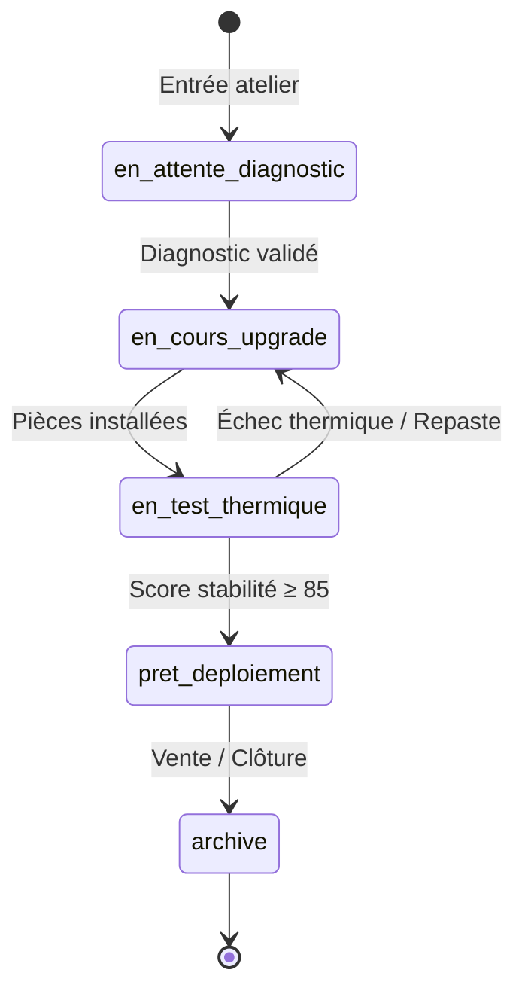

# Wiki · 02. Gestion d'Atelier & Reconditionnement Matériel

> **Auteur : Martial Zinsou**  
> **Projet : RoverIt — Workstation OS Hub**

---

## 1. Cycle de vie d'une Station de Travail

Toute station entrant dans la chaîne de reconditionnement passe par cinq statuts successifs et contrôlés :

1. **`en_attente_diagnostic`** : Inventaire visuel, détection matérielle automatique, état de santé initial.
2. **`en_cours_upgrade`** : Remplacement de pâte thermique, ajout de RAM, SSD NVMe, GPU ou dépoussiérage.
3. **`en_test_thermique`** : Validation sous charge lourde (Prime95 / FurMark / test interne) pendant 10 à 30 minutes.
4. **`pret_deploiement`** : Génération de la fiche technique certifiée PDF et valorisation marchande.
5. **`archive`** : Sortie de l'inventaire actif après déploiement client.

---

## 2. Ordres de Travail (OT) et Checklists

Chaque machine en révision est associée à un ou plusieurs **Ordres de Travail (OT)** comportant :
- Une priorité (`basse`, `normale`, `haute`, `critique`).
- Une liste de contrôle technique obligatoire :
  - *Nettoyage et dépoussiérage ultra-son ou air comprimé.*
  - *Application de pâte thermique haute conductivité.*
  - *Contrôle RPM des ventilateurs et roulements.*
  - *Vérification des tensions d'alimentation et connecteurs PCIe.*
  - *Test de stabilité thermique sous charge continue.*
- Un journal d'interventions consignant les pièces posées (déduites du stock) et le temps passé par technicien.

---

> Document Wiki rédigé par **Martial Zinsou**.
