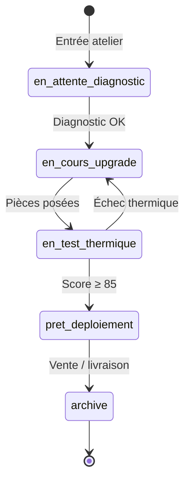
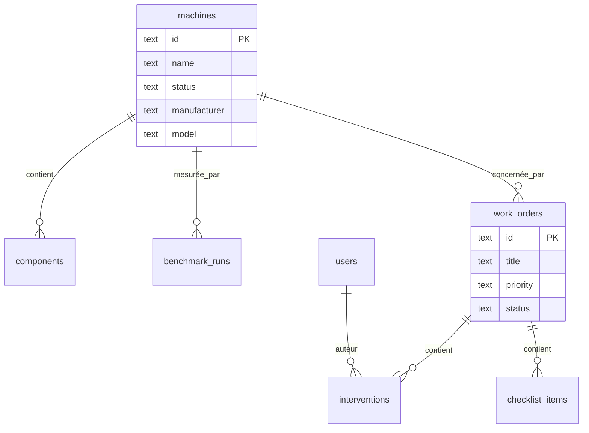
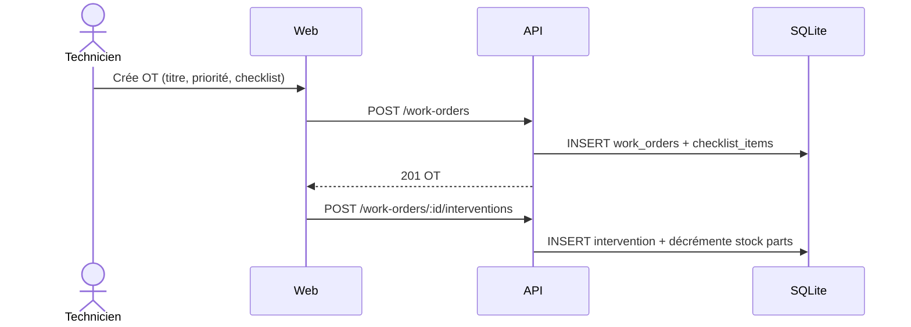

# Wiki · 02. Gestion d'Atelier & Reconditionnement

> **Auteur : Martial Zinsou**

---

## 1. Cycle de vie d'une station

### Captures

| Vue | Aperçu |
| :--- | :--- |
| Inventaire |  |
| Fiche machine |  |
| Catalogue pièces |  |

---

## 2. Schéma entité-association — Atelier

---

## 3. Séquence — Création d'un ordre de travail

---

## 4. Checklist technique obligatoire

- Nettoyage / dépoussiérage
- Pâte thermique MX-6
- Ventilateurs / RPM
- Connectique PCIe / alim
- Test stabilité 10 min

---

> Rédigé par **Martial Zinsou**.
