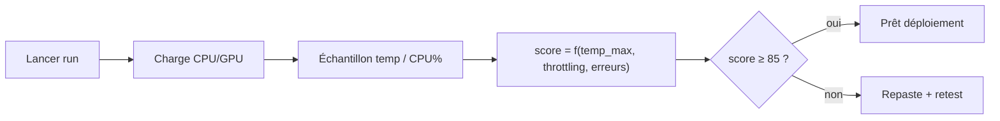
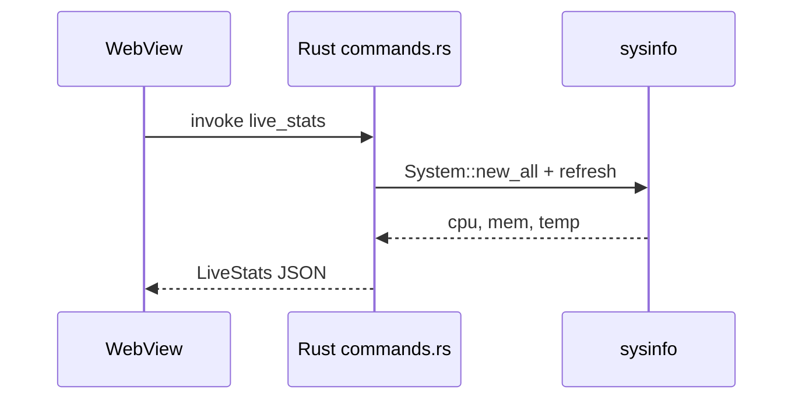
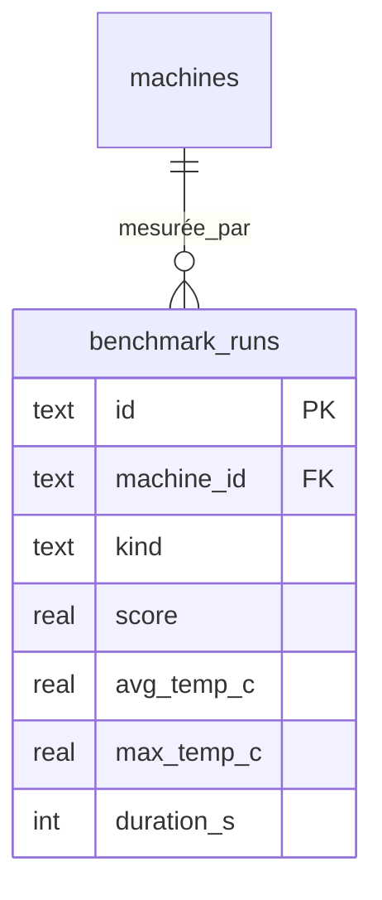

# Wiki · 03. Benchmark & Supervision Thermique

> **Auteur : Martial Zinsou**

---

## 1. Types d'épreuve

| Kind | Objectif | Durée |
| :--- | :--- | :--- |
| `stability` | Charge CPU+GPU combinée | 600 s |
| `cpu` | Stress multi-cœurs | 300 s |
| `gpu` | Shaders / VRAM | 300 s |
| `memory` | Intégrité RAM | 300 s |
| `thermal` | Courbe montée/dissipation | 600 s |

---

## 2. Score de stabilité

Normalisé 0–100. Seuil de validation : **≥ 85** → passage en `pret_deploiement`. En dessous, repaste thermique recommandé.

---

## 3. Télémétrie native (Tauri Rust)

`sysinfo 0.32` expose via commandes Tauri :

- `hardware_profile` → CPU, RAM, disques, batterie
- `live_stats` → `cpu_pct`, `mem_used`, `cpu_temp_c`, `freq_mhz`
- `run_stress_test(duration)` → boucle CPU bound + mesures

---

## 4. Modèle de données

---

> Rédigé par **Martial Zinsou**.
