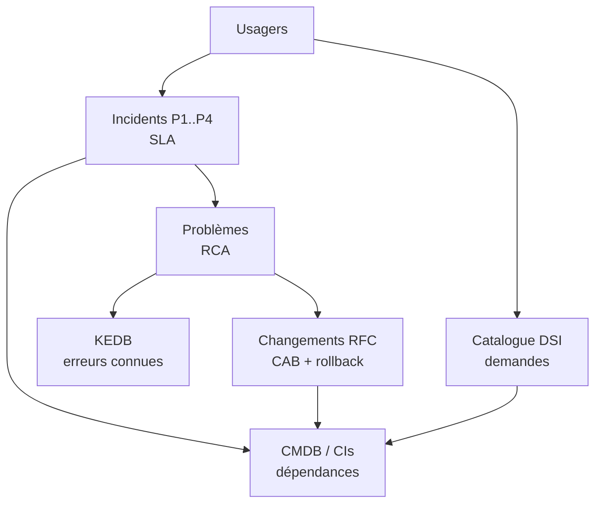
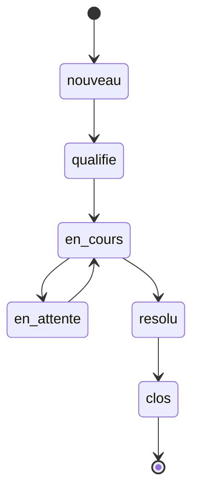
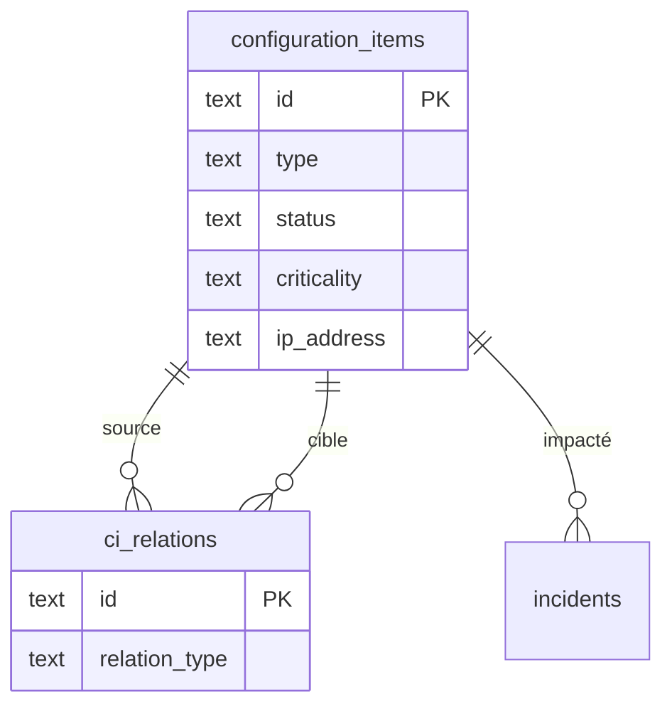
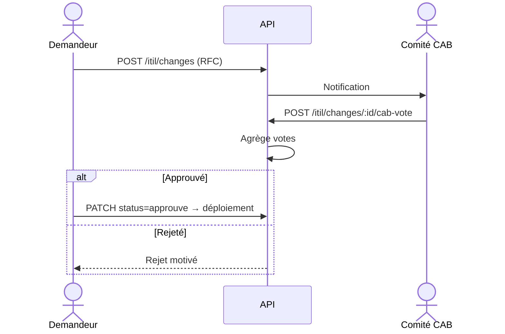
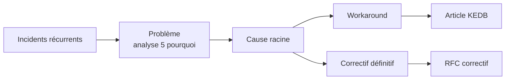

# Wiki · 04. Gouvernance DSI & Pratiques ITIL v4

> **Auteur : Martial Zinsou**

---

## 1. Les 5 pratiques ITIL

---

## 2. Incidents — Matrice Impact × Urgence

| Impact \ Urgence | Critique | Haute | Moyenne | Faible |
| :--- | :---: | :---: | :---: | :---: |
| **Critique** | P1 | P1 | P2 | P2 |
| **Élevé** | P1 | P2 | P2 | P3 |
| **Moyen** | P2 | P2 | P3 | P4 |
| **Faible** | P2 | P3 | P4 | P4 |

SLA : P1 **2h**, P2 **8h**, P3 **24h**, P4 **72h**.

Captures DSI :

| Vue | Fichier |
| :--- | :--- |
| Supervision DSI |  |
| Incidents & SLA |  |

---

## 3. CMDB — Modèle et dépendances

Types de relation : `depend_de`, `heberge`, `connecte_a`, `utilise_par`, `redondance_de`.

---

## 4. Changements — Workflow CAB

Niveaux : `standard` (pré-approuvé), `normal` (CAB), `urgent` (ECAB). Risque : `faible`→`critique`. Rollback plan obligatoire.

---

## 5. Problèmes & KEDB — RCA

Chaque article KEDB documente : symptômes, cause racine, workaround, fix, compteur `views_count`.

---

## 6. Catalogue de services

Prestations : station 3D, PC nomade, compte ERP, VPN MFA, upgrade RAM, diagnostic atelier. Délai estimé + prix + SLA livraison. Workflow : `soumise` → `approuvee` → `en_traitement` → `livree`.

---

> Rédigé par **Martial Zinsou**.
