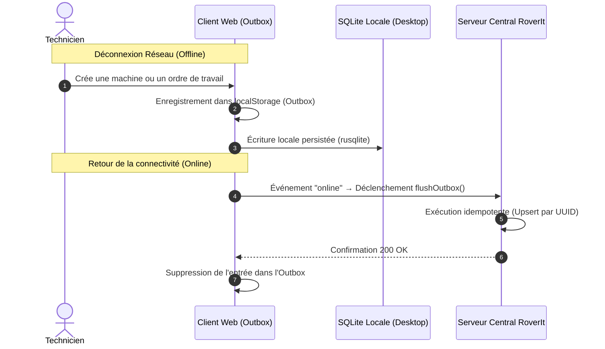

# Wiki · 05. Mode Hors-Ligne & Protocole de Synchronisation

> **Auteur : Martial Zinsou**  
> **Projet : RoverIt — Workstation OS Hub**

---

## 1. Philosophie Offline-First

Un atelier ou un site d'intervention peut être temporairement privé de connexion Internet. RoverIt garantit une continuité opérationnelle totale hors-ligne grâce à une stratégie hybride :

---

## 2. Idempotence des Écritures

Chaque entité créée (machine, composant, intervention, incident) dispose d'un identifiant universellement unique généré côté client (`crypto.randomUUID()`). Les requêtes rejouées sur le serveur utilisent l'opération SQLite `INSERT INTO ... ON CONFLICT(id) DO UPDATE ...`, éliminant tout risque de doublon.

---

> Document Wiki rédigé par **Martial Zinsou**.
