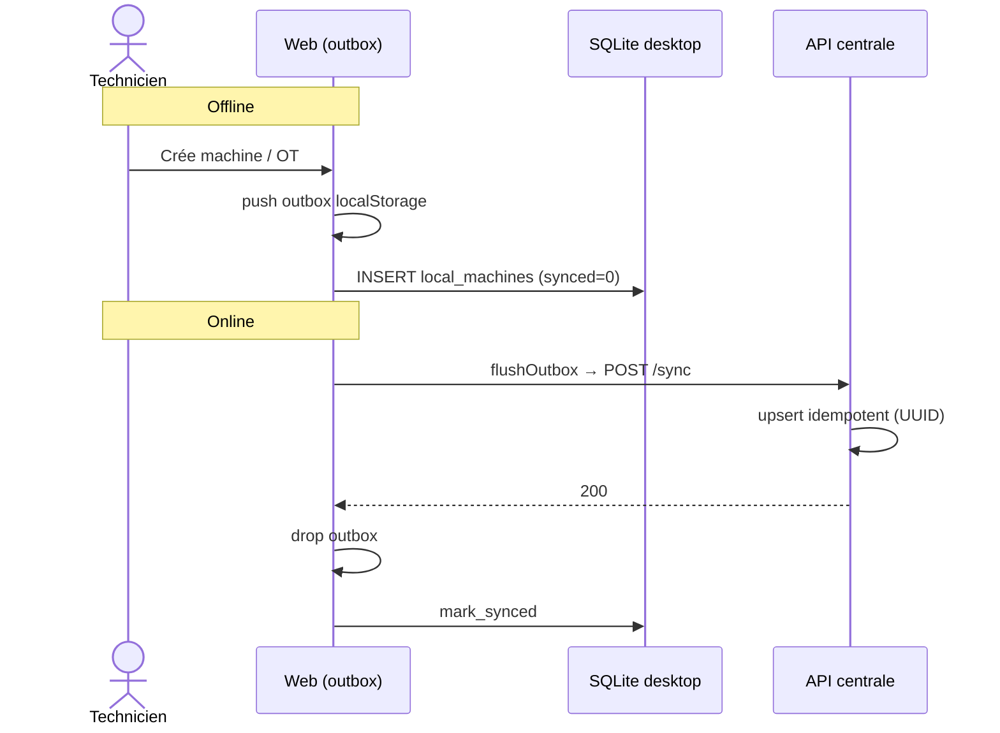
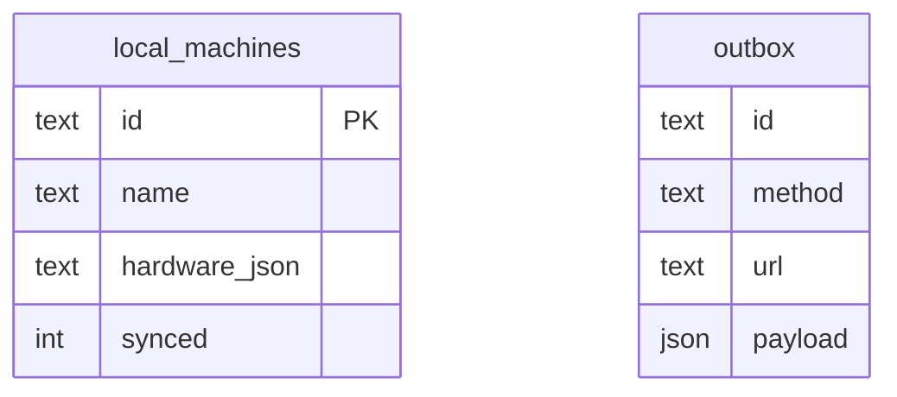

# Wiki · 05. Mode Hors-Ligne & Synchronisation

> **Auteur : Martial Zinsou**

---

## 1. Philosophie offline-first

---

## 2. Idempotence

UUID `crypto.randomUUID()` côté client + `INSERT ... ON CONFLICT(id) DO UPDATE` côté serveur. Rejeu sans doublon.

---

## 3. Cache et résilience

GET mis en cache 60 s (`roverit.cache`). Si fetch échoue et hors-ligne, lecture du cache. WebSocket reconnexion automatique.

---

> Rédigé par **Martial Zinsou**.
