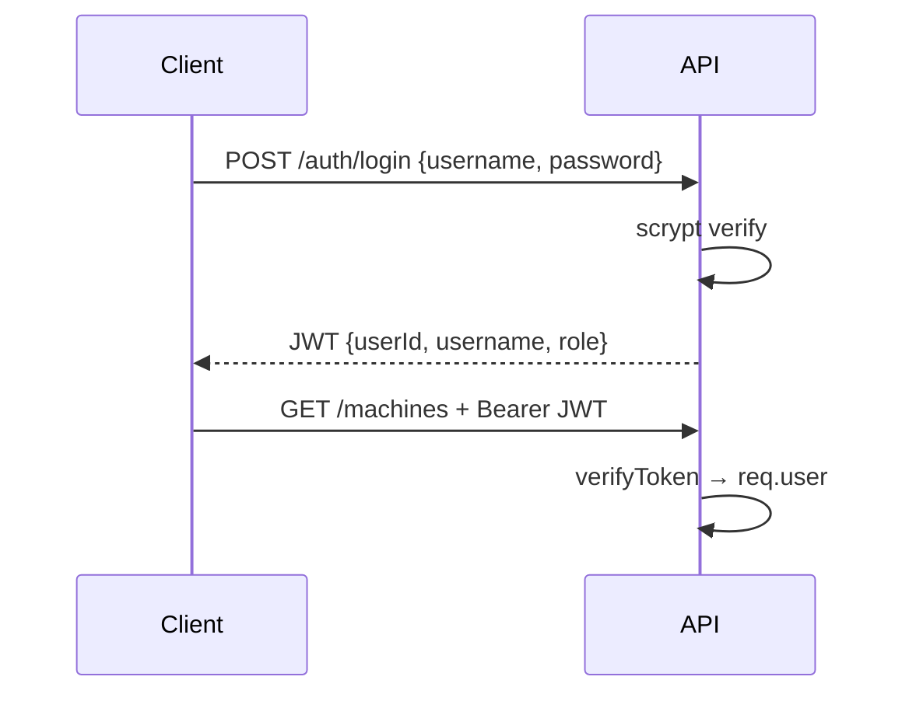
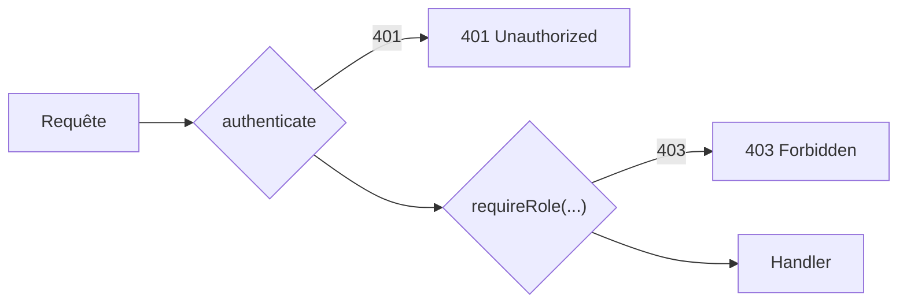

# Wiki · 06. Sécurité, Authentification & RBAC

> **Auteur : Martial Zinsou**

---

## 1. Authentification JWT

- HS256, secret `JWT_SECRET`, TTL 12h, header `Authorization: Bearer <token>`.
- Mots de passe : `scrypt` + sel aléatoire (`salt:hash`).

---

## 2. Matrice RBAC

| Fonction | technicien | admin | consultant |
| :--- | :---: | :---: | :---: |
| Lecture dashboard/rapports | ✅ | ✅ | ✅ |
| CRUD machines/benchmarks | ✅ | ✅ | ❌ |
| Incidents / RFC / KEDB | ✅ | ✅ | ❌ |
| Catalogue commande | ✅ | ✅ | ✅ |
| Gestion users / suppression | ❌ | ✅ | ❌ |

---

## 3. Audit

Table `audit_events` : `entity`, `entity_id`, `action`, `user_id`, `payload`, `created_at`. Tracé sur chaque écriture sensible.

---

> Rédigé par **Martial Zinsou**.
