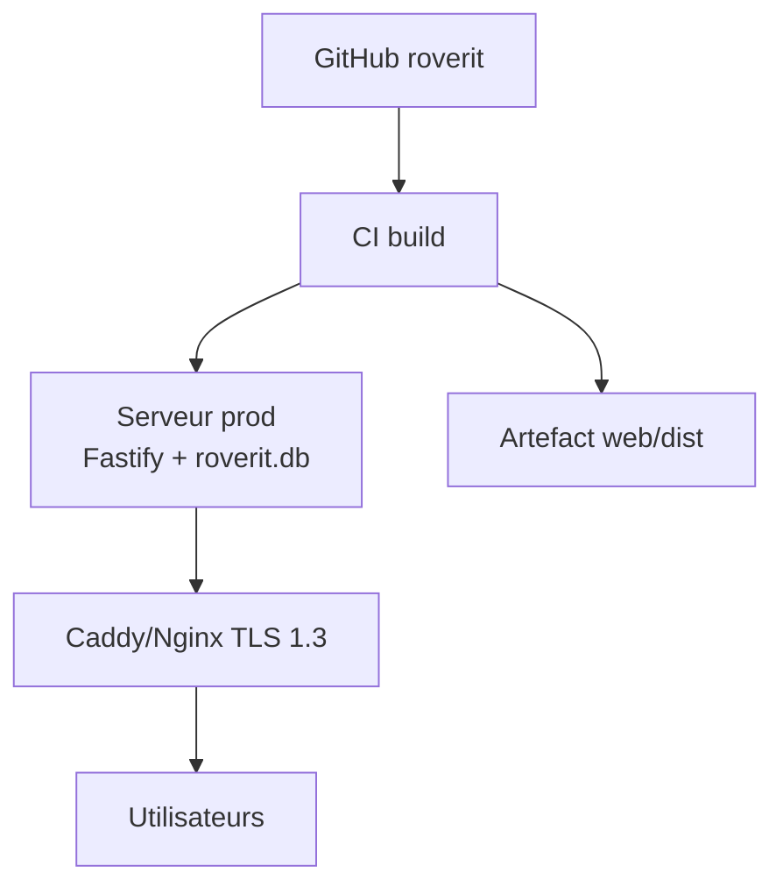

# Wiki · 07. Guide de Déploiement & Exploitation

> **Auteur : Martial Zinsou**

---

## 1. Prérequis

- Node 20/22 LTS, npm 10+
- Rust 1.75+ (desktop Tauri)
- SQLite (bundled)

## 2. Variables d'environnement

| Variable | Défaut | Description |
| :--- | :--- | :--- |
| `PORT` | 3001 | Port Fastify |
| `HOST` | 0.0.0.0 | Bind |
| `DB_PATH` | ./data/roverit.db | Fichier SQLite |
| `JWT_SECRET` | dev-secret | Signature JWT |
| `TOKEN_TTL` | 12h | TTL session |
| `PUBLIC_DIR` | ../web/dist | Frontend servi |

## 3. Commandes

```bash
npm install
npm run typecheck
npm test          # 14/14
npm run build
npm start         # prod
```

---

## 4. Déploiement — Schéma



---

## 5. Rapports & exploitation


Export PDF via `pdfkit` : fiche machine certifiée (composants, benchmarks, OT).

---

> Rédigé par **Martial Zinsou**.
