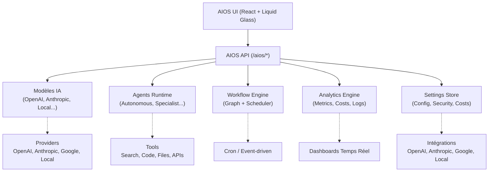

# AI Operating System (AIOS) — Aperçu

> **Auteur : Martial Zinsou**  
> **Version : 1.0 — Interface Liquid Glass**

---

## 1. Vue d'ensemble

AIOS (AI Operating System) est le module d'intelligence artificielle intégré à RoverIt. Il fournit une plateforme unifiée pour :

- **Chat IA** : Interface conversationnelle multi-modèles avec gestion de l'historique
- **Agents IA** : Création, déploiement et monitoring d'agents autonomes
- **Modèles IA** : Catalogue et gestion des modèles de langage (LLM, embedding, vision, audio)
- **Workflows** : Orchestration visuelle de pipelines IA (no-code/low-code)
- **Analytics** : Métriques d'usage, coûts, performance, qualité
- **Paramètres** : Configuration centralisée (modèles, agents, sécurité, coûts, intégrations)

---

## 2. Architecture AIOS



---

## 2.1. Composants Principaux

| Composant | Description | Endpoints API |
|-----------|-------------|---------------|
| **AIOS Dashboard** | Vue d'ensemble KPIs, modèles, agents, workflows | `GET /aios/dashboard` |
| **AIOS Chat** | Interface conversation multi-modèles | `POST /aios/chat` |
| **AIOS Agents** | CRUD agents, déploiement, monitoring | `GET/POST/PATCH/DELETE /aios/agents` |
| **AIOS Models** | Catalogue modèles, déploiement, coûts | `GET/POST/PATCH/DELETE /aios/models` |
| **AIOS Workflows** | Éditeur visuel, exécution, scheduling | `GET/POST/PATCH/DELETE /aios/workflows` |
| **AIOS Analytics** | Métriques, coûts, performance, quality | `GET /aios/analytics` |
| **AIOS Settings** | Configuration globale (onglets) | `GET/PATCH /aios/settings` |

---

## 3. Interfaces Utilisateur (Liquid Glass)

| Page | Description | Captures |
|------|-------------|----------|
| **Dashboard AIOS** | KPIs globaux, modèles actifs, agents, workflows, coûts | `17-aios-dashboard.png` |
| **Chat IA** | Conversation multi-modèles, sélection modèle, historique | `18-aios-chat.png` |
| **Agents** | Liste, création, édition, déploiement, capabilities | `19-aios-agents.png` |
| **Modèles** | Catalogue, déploiement, coûts, paramètres | `20-aios-models.png` |
| **Workflows** | Éditeur visuel (noeuds/edges), exécution, scheduling | `21-aios-workflows.png` |
| **Analytics** | Requêtes, coûts, latence, modèles, agents | `22-aios-analytics.png` |
| **Settings** | Onglets: Général, Modèles, Agents, Workflows, Sécurité, Coûts, Intégrations | `22-aios-settings.png` |

---

## 4. API Endpoints Principaux

### Dashboard
```
GET  /api/v1/aios/dashboard          # KPIs globaux
```

### Chat
```
POST /api/v1/aios/chat               # Envoyer message, recevoir réponse
GET  /api/v1/aios/chat/history       # Historique conversations
```

### Modèles
```
GET    /api/v1/aios/models           # Liste modèles
POST   /api/v1/aios/models           # Créer modèle
GET    /api/v1/aios/models/:id       # Détail modèle
PATCH  /api/v1/aios/models/:id       # Mettre à jour
DELETE /api/v1/aios/models/:id       # Supprimer
```

### Agents
```
GET    /api/v1/aios/agents           # Liste agents
POST   /api/v1/aios/agents           # Créer agent
GET    /api/v1/aios/agents/:id       # Détail agent
PATCH  /api/v1/aios/agents/:id       # Mettre à jour
DELETE /api/v1/aios/agents/:id       # Supprimer
POST   /api/v1/aios/agents/:id/execute  # Exécuter agent
```

### Workflows
```
GET    /api/v1/aios/workflows        # Liste workflows
POST   /api/v1/aios/workflows        # Créer workflow
GET    /api/v1/aios/workflows/:id    # Détail + éditeur
PATCH  /api/v1/aios/workflows/:id    # Mettre à jour
DELETE /api/v1/aios/workflows/:id    # Supprimer
POST   /api/v1/aios/workflows/:id/execute  # Exécuter
```

### Analytics
```
GET /api/v1/aios/analytics?period=7d  # Métriques globales
```

### Settings
```
GET  /api/v1/aios/settings           # Tous les paramètres
PATCH /api/v1/aios/settings/:section # Mettre à jour section
```

---

## 5. Modèles de Données

### AIModel
```typescript
interface AIModel {
  id: string;
  name: string;
  type: 'llm' | 'embedding' | 'vision' | 'audio' | 'multimodal';
  provider: string;
  parameters: number;
  context_length: number;
  cost_per_1k: number;
  status: 'active' | 'deprecated' | 'testing' | 'archived';
}
```

### AIAgent
```typescript
interface AIAgent {
  id: string;
  name: string;
  type: 'assistant' | 'specialist' | 'autonomous' | 'workflow';
  model: string;
  status: 'idle' | 'running' | 'paused' | 'error';
  capabilities: string[];
  description: string;
  system_prompt: string;
}
```

### AIWorkflow
```typescript
interface AIWorkflow {
  id: string;
  name: string;
  description: string;
  status: 'draft' | 'active' | 'paused';
  nodes: WorkflowNode[];
  edges: WorkflowEdge[];
  schedule: string;  // cron expression
  last_run: string | null;
  next_run: string | null;
}
```

---

## 6. Captures d'écran AIOS (Liquid Glass)

| # | Vue | Fichier |
|-----|------|---------|
| 17 | AIOS Dashboard | `17-aios-dashboard.png` |
| 18 | AIOS Chat IA | `18-aios-chat.png` |
| 19 | AIOS Agents | `19-aios-agents.png` |
| 20 | AIOS Modèles | `20-aios-models.png` |
| 21 | AIOS Workflows | `21-aios-workflows.png` |
| 22 | AIOS Analytics | `22-aios-analytics.png` |
| 23 | AIOS Settings | `22-aios-settings.png` |

---

## 6. Sécurité & Conformité

- **Chiffrement** : AES-256 au repos, TLS 1.3 en transit
- **Authentification** : JWT HS256, RBAC (admin/technicien/consultant)
- **Audit** : Journal immuable `audit_events` pour toutes les actions AIOS
- **Rate Limiting** : Configurable par utilisateur/IP
- **Rotation clés** : Rotation automatique des clés API (optionnel)

---

## 7. Déploiement & Exploitation

```bash
# Variables d'environnement AIOS
AIOS_OPENAI_KEY=sk-...
AIOS_ANTHROPIC_KEY=sk-...
AIOS_GOOGLE_KEY=...
AIOS_LOCAL_MODELS_PATH=/models
AIOS_DB_PATH=./data/aios.db
AIOS_LOG_LEVEL=info
```

```bash
# Démarrage
npm run dev:server    # API sur port 3001
npm run dev:web       # Frontend sur port 5173
npm run build         # Production
npm start             # Production server
```

---

## 8. Roadmap

- [ ] **RAG natif** : Intégration vector store (pgvector, chroma)
- [ ] **Fine-tuning** : Pipeline d'entraînement/finetuning modèles
- [ ] **Multi-modal** : Support complet vision/audio
- [ ] **Marketplace agents** : Partage/import agents communautaires
- [ ] **Observabilité avancée** : Traces distribuées, alerting

---

> Conçu et développé par **Martial Zinsou** — Interface **Liquid Glass** (Apple WWDC25 + Google Material 3 Expressive)